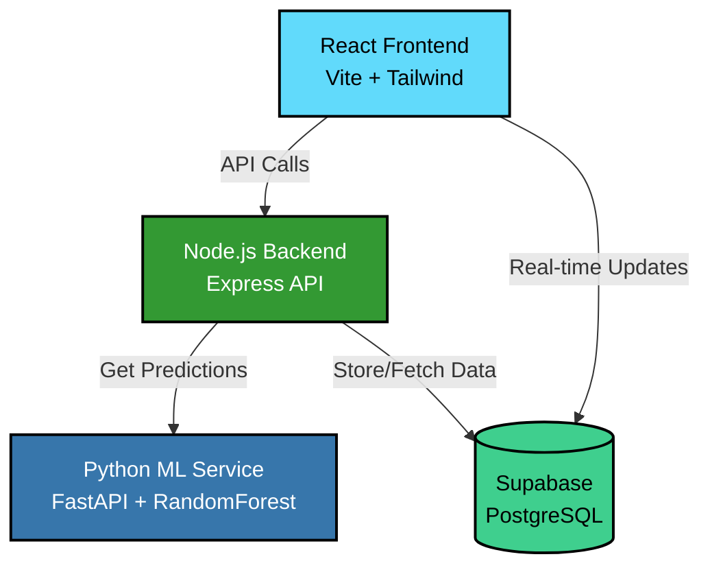

# AI-Powered Nutrition Coach

<p align="center">
  
  
  
  
  
</p>

> An intelligent, full-stack web application that acts as a personal diet coach. It uses a machine learning model to generate highly personalized, goal-specific meal plans that dynamically adapt to the user's daily feedback.

---
## Hosted Links
- Frontend/Backend - [https://ai-powered-nutrition-coach.vercel.app](https://ai-powered-nutrition-coach.vercel.app)
- ML-service - [https://ai-nutrition-ml-service.onrender.com](https://ai-nutrition-ml-service.onrender.com)

---
## Screenshots

<p align="center">
  
  <br>
  <em>The main dashboard, showing the user's progress, goals, streaks and historical plans.</em>
</p>

<p align="center">
  
  <br>
  <em>The picture showcasing the history of plans created </em>
</p>

---

## Features in Depth

This application is more than just a plan generator; it's an adaptive coaching system.

* 🧠 **AI-Powered Plan Generation**
    * **How it works:** A `RandomForestRegressor` model, trained on a synthetically generated dataset of over 10,000 user profiles derived from the Harris-Benedict Equation, analyzes the new user's biometrics and goals. It predicts a precise, scientifically-backed set of daily targets for calories, protein, carbs, and fat, ensuring a safe minimum intake of 1200 calories.

* 🎯 **Goal-Specific Diets & Meal Assembly**
    * **How it works:** The backend "chef" algorithm receives the AI-generated targets and the user's specific goal (e.g., `Weight Loss`, `Muscle Gain`, `Carbo-Cut Diet`). It then intelligently queries the food database with goal-specific filters (e.g., ordering by lowest carbs for a "Carbo-Cut") to construct realistic, multi-component meals with accurate portion sizes calculated in grams.

* 🔄 **Dynamic Adaptation Loop**
    * **How it works:** Users provide daily feedback on satiety and energy levels. The backend's `Adaptation Engine` analyzes this feedback and calculates small, daily adjustments to the nutritional targets. If a user reports low energy, their calorie target might be slightly increased. This creates a closed-loop system where the plan continuously evolves with the user.

* 🔥 **Gamified Streaks & Progress Tracking**
    * **How it works:** Each meal in a daily plan can be checked off. When all meals for a day are completed, a secure PostgreSQL function (`update_streak`) is called on the backend. This function contains robust logic to increment the user's streak, decrement it if a day becomes incomplete, and reset it to zero if the user misses a day, providing a gamified incentive for consistency.

* 📈 **Historical Tracking & Visualization**
    * **How it works:** Every generated plan is saved to the database. The React frontend fetches this history and displays it in a clean, interactive accordion. A `recharts` graph on the dashboard provides a visual summary of the user's calorie intake over the last 7 days.

---

## System Architecture

The application is built on a modern, decoupled architecture, with a clear separation of concerns between the frontend, backend, and the machine learning service.


---

## Technology Stack

| Category         | Technology                                                            |
| ---------------- | --------------------------------------------------------------------- |
| **Frontend** | React.js (Vite), Tailwind CSS, Recharts                               |
| **Backend** | Node.js, Express.js                                                   |
| **Machine Learning**| Python, FastAPI, Scikit-learn, Pandas                                 |
| **Database** | Supabase (PostgreSQL)                                                 |
| **Deployment** | Vercel (Frontend/Backend), Docker (ML Service)                        |

---

## Getting Started

To run this project locally, you will need **Node.js**, **Python**, and **Docker Desktop** installed.

### 1. Initial Setup
Clone the repository and install dependencies for both the frontend and backend.
```bash
git clone <your-repo-url>
cd ai-powered-nutrition-coach
cd backend && npm install && cd ..
cd client && npm install && cd ..
```

### 2. Database & Environment Setup
- Create a Supabase Project and run the `infra/scripts/migrate_db.sql` script in the SQL Editor.
- Configure Environment Variables: Create and fill in the `.env` files in the `backend/`, `client/`, and `ml-service/` directories.
- Seed the Database: Download the required food nutrition CSV, name it `food_nutrition.csv`, place it in `infra/scripts/`, and run `node infra/scripts/seed_food_data.js` from the project root.

### 3. Machine Learning Service Setup
Create Virtual Environment and install dependencies:
```bash
cd ml-service
python -m venv venv && source venv/bin/activate
pip install -r requirements.txt
cd ..
```

Train the Model: Run the training script from the project root:
```bash
python ml-service/scripts/train_model.py
```

### 4. Running the Application
You will need three separate terminals running concurrently from the project root.

- **Terminal 1 (ML Service):** `cd infra && docker-compose up --build`
- **Terminal 2 (Backend):** `npm run start:backend`
- **Terminal 3 (Frontend):** `npm run dev`

Your application will be live at `http://localhost:5173`.
